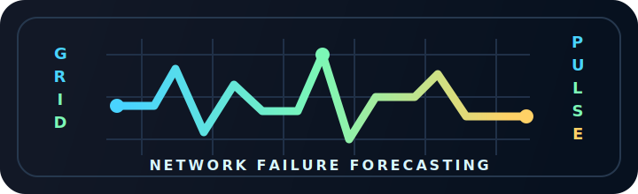

# GridPulse

<p align="center">
  
</p>

**GridPulse** is a predictive failure analysis command center for telecom-style network operations. It turns event streams into risk bands, estimated outage windows, alert queues, and accuracy feedback so operators can see which assets are starting to fail before the outage fully lands.

The project uses the KDD Cup 1999 dataset as a replayable network-event source, maps each row into a normalized `NetworkEvent`, scores assets over a sliding time window, and presents the current failure posture in an Angular command center.

## Project Scope

GridPulse is designed as an end-to-end prototype for operational failure forecasting:

- **Ingest network telemetry** through a REST endpoint, Kafka consumer, KDD replay job, or fallback simulator.
- **Normalize legacy security data** into a telecom-friendly event model with asset IDs, event types, severity, metadata, and optional ground-truth labels.
- **Score asset health** using recent severity pressure, traffic-volume pressure, and confirmed failure evidence.
- **Forecast risk** as a failure probability, risk band, and estimated time to failure.
- **Surface high-risk assets** in a command-center UI with live refresh, severity badges, probability bars, and model-quality metrics.
- **Measure prediction quality** using KDD labels to track total predictions, correct predictions, false positives, false negatives, and overall accuracy.
- **Persist operational history** in PostgreSQL for events and prediction records.

Out of scope for the current version:

- Production-grade machine learning training pipelines.
- Multi-tenant authorization and role-based access control.
- Long-term feature-store management.
- Automated remediation workflows.
- Cloud deployment manifests.

## System Architecture

```text
KDD CSV / Simulator / REST
          |
          v
Kafka topic or direct API ingestion
          |
          v
Spring Boot ingestion layer
          |
          v
PostgreSQL event + prediction tables
          |
          v
Sliding-window prediction service
          |
          v
REST API
          |
          v
Angular command center
```

## Core Capabilities

### Event Ingestion

GridPulse can ingest events in three ways:

- `POST /api/events` for direct event submission.
- Kafka consumer flow for stream-style event processing.
- KDD replay service for repeatable historical dataset playback.
- Fallback simulator for demos when the dataset is unavailable.

### Prediction Engine

The prediction service evaluates each asset over a configurable recent-event window. Its current heuristic combines:

- **Severity pressure:** critical, high, and medium events weighted by operational urgency.
- **Traffic pressure:** average traffic volume derived from `src_bytes + dst_bytes`.
- **Failure evidence:** KDD labels used as confirmation signals and accuracy ground truth.

The result is a probability between `0.0` and `1.0`, a risk band (`healthy`, `warning`, or `critical`), and an estimated failure time.

### Command Center

The Angular UI focuses on fast operator scanning:

- Model accuracy summary.
- Total prediction count.
- Correct prediction count.
- False positive and false negative counts.
- At-risk asset table.
- Probability bars for each flagged asset.
- Estimated outage time.
- Severity badges.

## Tech Stack

- **Backend:** Java 21, Spring Boot 3.x
- **Streaming:** Kafka 3.x
- **Database:** PostgreSQL 15+
- **Frontend:** Angular 17+
- **Dataset tooling:** Python, `kagglehub`

## Project Layout

```text
src/main/java/com/gridpulse/ingestion
  KDD parser, Kafka replay engine, Kafka consumer, fallback simulator

src/main/java/com/gridpulse/service
  Sliding-window prediction and KDD label accuracy scoring

src/main/resources/db/schema.sql
  PostgreSQL tables and indexes

frontend/src/app/grid-pulse
  Angular command center component

scripts/download_kdd.py
  Kaggle dataset downloader using kagglehub

docs/gridpulse-logo.svg
  Project logo used in this README
```

## Dataset

Download and extract the KDD Cup 1999 10 percent dataset:

```bash
pip install kagglehub
python scripts/download_kdd.py
```

The script downloads `galaxyh/kdd-cup-1999-data`, extracts `kddcup.data_10_percent.gz`, and writes:

```text
data/kddcup.data_10_percent.csv
```

## Data Mapping

| KDD field | GridPulse field | Purpose |
| --- | --- | --- |
| `duration` | `metadata.duration` | Connection duration context |
| `protocol_type` | `eventType` | Event category |
| `flag` | `severity` | Operational risk signal |
| `src_bytes + dst_bytes` | `metadata.trafficVolume` | Traffic pressure signal |
| `label` | `kddLabel` | Ground-truth accuracy reporting |

Severity mapping:

| KDD flag | Severity |
| --- | --- |
| `SF` | `LOW` |
| `REJ` | `MEDIUM` |
| `S0`, `S1`, `S2`, `S3` | `HIGH` |
| `ERROR` | `CRITICAL` |

## Backend Setup

Create the PostgreSQL database/user, start Kafka, then run:

```bash
mvn spring-boot:run
```

Enable KDD replay:

```bash
mvn spring-boot:run -Dspring-boot.run.arguments="--gridpulse.replay.enabled=true"
```

Enable the fallback simulator:

```bash
mvn spring-boot:run -Dspring-boot.run.arguments="--gridpulse.simulator.enabled=true"
```

## API

| Method | Endpoint | Description |
| --- | --- | --- |
| `POST` | `/api/events` | Ingest a network event and record a fresh prediction |
| `GET` | `/api/assets/{assetId}/prediction` | Return the current prediction for one asset |
| `GET` | `/api/alerts` | List assets above the high-risk threshold |
| `GET` | `/api/accuracy` | Return prediction accuracy counters |

## Frontend Setup

```bash
cd frontend
npm install
npm start
```

The Angular dev server proxies `/api` to `http://localhost:8080`.

## Roadmap

- Replace the heuristic scorer with a trained model while keeping the same API contract.
- Add asset topology awareness so upstream/downstream failures influence risk.
- Add alert acknowledgement and incident lifecycle tracking.
- Add historical trend charts for risk, volume, and severity.
- Package the system with Docker Compose for one-command local demos.
